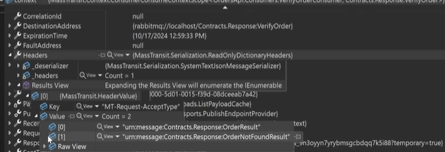
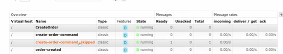
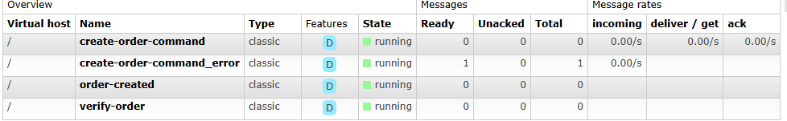
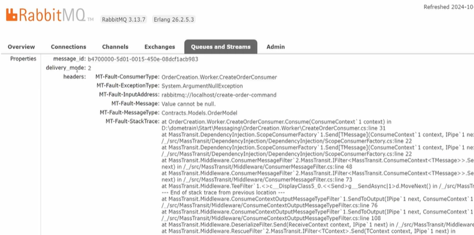
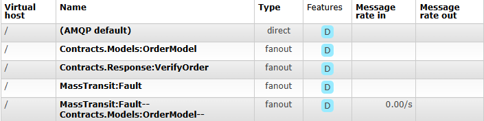

# Messaging in .net with mass transit

Asynchronous messaging is a communication method that replaces traditional http request response pattern, and aims to resolve scalability problems in services oriented architectures. The traditional web apis, served over http have several problems that asynchronous messaging is trying to solve:

1. Tight coupling between components and services inside organzation. If service A calls servive B that then calls service C, they are tightly coupled. Service A needs B and C in order to even function. Usually, when one of the service changes, the others have to change too.
2. Solve cascading failures. When communication is synchronous, if service A call service b that then calls service C, we are introducing a lot of latency in the request. Not only that.. what happens if one of the services fails? The whole chain fails.. What if one of the services is slow? it will make the overall system very slow and unresponsive.
3. Restfull apis are limited by request response patterns. This is inflexible to implement complex workflows and event driven architectures.
4. Scalling of services. Synchronous services are very hard to scale, because even if we have many instances of them running, they are still dependent on all the other services.
5. Long running operations where request response patterns are not very well suited. Example: client asks for long running operation ans gets notifed when it is complete.

Messaging is not a silver bullet. Things to consider:

1. Messaging system introduces complexity in development.
2. Complexity in monitoring, troubleshooting, etc.
3. Harder to maintain infrastructrue. The infrastructure needs to be thought out for high availability.
4. Message ordering is challeging. Some systems can guarantee that at queue level, but on the overall system level can be very complex.
5. Message deduplication. Duplication of messages can occur due to network failures and retries, etc. So this requires idempotency implementation of message handling.
6. Message delivery guarantees (only once, at least once, etc)
7. Vendor lock in. Can be hard to switch messaging system in the future if we tightly couple the implementation details to any particular message broker. Use abstractions like mass transit can be good, that allow us to switch brokers.

## Basic concepts

So what is this pattern all about?
Instead of requests, we now have messages. The traditional http client becomes a sender (Producer/Publisher).
The server is the receiver or the consumer of the message. In this type of communication the sender does not wait for a response from the receiver.
It continues to do work while the receiver will handle the messages at a later time (components work independently, scale better and can hanlde large handle big message volume). Large volume processing can be achived by scalling the consumers horizontally making the system is more fault tolerant (if a service is unavailable mesages get queued and can be processed at a later time).

The services become loosely coupled. The send only cares about sending the message, without caring too much who will be receiving it.
This also allows services written in different technologies to integrate with each other in a neutral way.
If a service is very busy, a producer can still keep producing messages. We solve the temporal coupling problem. Messaages will be processed eventually.

### Messages

A message is a unit that carries information to a different component. It is made of:

1. Headers -> set by the messaging system or manually by us.
2. Payload -> business data to be broadcasted to different components.

In mass transit a message can be sent by creating a class, record or an instance of an interface. These classes should not have any behavior at all because they only transport data between components.
Messages are reference types.
Messages can also be initialized as anonymous types and be sent to publish and send methods.
Mass transit will inclue the headers, things like the content type of the message: most of the time "application/vnd.masstransit". It can also include the destination of the message, fault reasons and so on.
It is a best practice to keep messages in a separate library.

### Delivery modes/guarantees

Devivery modes or guarantees define how strongly a messaging system enforces the delivery of a message it handles. This refers to the assurance that the message sent will be delivered snd processed by some criteria.
This is an important design consideration as strong delivery guarantees need require more from the system (more checks and aknowledgements).
Each message is uniquely identified and their delivered state is maintained to ensure they are only delivered a certain amount of times. The three delivery modes:

1. At most once: fire and forget. In this mode, brokers deliver messages to consumers without any aknowledgement from the consumer. After the broker sends, even if the consumer crashes, the system will move on.
   This is a low latency and high throughput mode but messages can get lost.

2. At least once: the broker ensures messages are delivered at least once. The broker waits for the aknowledgment from the consumer. After the aknowledgment is received, the broker removes the the message from the queue. If the aknowledgment is not received by a certain amount of time, the Time-To-Live of the message, the broker will assume that the message was not processed. This mode ensures message delivery but can result in duplicated message processing (consumer crashes after processing the message but before sending an acknowledgment).

3. Exactly once: or transactional delivery. Some brokers support this feature where messages are delivered exactly once without duplicates or losses. In this mode, consumers process messages within a transaction, ensuring messages and processed and aknowledged or rolled back in case of failures. This mode incurs higher latency and reduced throughput. Sometimes it is achieved with additional patterns to the broker, like inbox, outbox and ensuring message idempotency.

### Topologies

A topology refers to the configuration and the structure of the message routing, including how exchanges, qeuues, bindings are set up and managed within the message broker.
It is how messages types are used to configure broker infrastructure, like broker topics and queues.
They are used to access broker capabilities like direct exchanges and routing keys.
Example: different exchanges will result in different routing behavior in rabbitmq.
Another examples: in mass transit a queue corresponds to a consumer or groups of consumers.

Types of topologies:

1. Automatic. When we leave up to mass transit to do the work of creating the underlying infrastructure on the transport.
2. Custom: mass transit will configure the topology at the recieve endpoint level. We can for example, when we do publish, a topology will populate a routing key of the message that is sent. This is a publi topology. We can have message topology too.

### Endpoints

In mass transit, endpoints are messaging addresses or destinations to which messages are sent. It is vital in organizing and routing messages between different application ports.
Mass transit configures endpoints for us based on conventions and should be what we use most of the time. However we can costumize it.
We can haveÇ

1. Receive endpoints: destination to receive messages. It is a well known queue where a consumer will listen and receive messages for processing. It is tied to a specific messagr queue or topic depending on the topic we are using.
2. Publish endpoints: publish events to all interested subscribers. We usually do not intereact directly.
3. Send endpoints. This representd the address where messages are sent explicitly without needing to know about consumers.

We can configure endpoints to specify different things like transport, subscriptions, concurrency and Prefetch limits, retry policies, etc

And endpoints is then somtehing that abstract the phisical messaging infrastrucure. It provides the mechanism for sending, receiving, or publish messages to a transport in a transport agnostic way.

## Mass transit

The framework that abstracts the complexity of dealing with messaging apis and infrastructure. It is like the repository pattern for database: we can have azure service bus, rabbit mq, amazon sqs with minimal code changes.
It has buuilt in retry polocies, message serialization (we only define the message contracts and mass transit handles the deserialization for us), It also has a middleware pipeline that enable us to plug in and out logging , auth , monitoring and management. It also supports testing of message based application through its testing harness.

Mass transit is added to the service collection in asp.net core:

```
            builder.Services.AddMassTransit(options =>
            {
                options.UsingRabbitMq((context, config) =>
                {
                    config.ConfigureEndpoints(context);
                });
            });
```

Everything we added here will be available on the bus, like filter, retry policies, etc.
This is the minimum to have mass transit to work. It uses the default rabbitmq username and password behind the scenes so if we need extra configuration it would be needed to be applied here.
Publishing our first message, when we create an order:

```

        [HttpPost]
        public async Task<ActionResult<Order>> PostOrder(OrderModel model)
        {
            //verify stock
            //var stocks = await productStockServiceClient.GetStock(
            //    model.OrderItems.Select(p => p.ProductId).ToList());

            var orderToAdd = mapper.Map<Order>(model);
            var createdOrder = await _orderService.AddOrderAsync(orderToAdd);
            var publishOrder = _publishEndpoint.Publish(new OrderCreated { CreatedAt = createdOrder.OrderDate, Id = createdOrder.Id, OrderId = createdOrder.OrderId, TotalAmount = createdOrder.OrderItems.Sum(i => i.Quantity * i.Price) });
            return CreatedAtAction("GetOrder", new { id = createdOrder.Id }, createdOrder);
        }
```

This is done by inject IPublishEndpoint interface. When we send that event we see on the rabbitmq console the exchange created by mass transit:

Mass transit did not create a queue because no consumer got connected to it.
we can also publish as anonymous types etc, like seen before.

How do we create a consumer? Like this:

```
    public class OrderCreatedConsumer : IConsumer<OrderCreatedConsumer>
    {
        public Task Consume(ConsumeContext<OrderCreatedConsumer> context)
        {
            throw new NotImplementedException();
        }
    }
```

Note the implementation of the IConsumer interface. This is how a consumer of a message of type T gets created.
It should be noted when a message type is shared between the producer and the consumer, it needs to have exactly the same namespace. So it is typical to share the messages with a class library.
The Consume context gives us access to a few properties: like message headers, the message itself, the source of the message, what happens in case of fault, etc.
We need to register the consumer in the mass transit pipeline. Notice that it is done before the line UsingRabbitMq because the consumers are independent of the transport.

```
    builder.Services.AddMassTransit(options =>
    {
        options.AddConsumer<OrderCreatedConsumer>(); // assembly scanning also works, etc
        options.UsingRabbitMq((context, config) =>
        {
            config.ConfigureEndpoints(context);
        });
    });
```

After we do this and navigate to the queues tab in rabbitmq we will see we have a queue, order created! We see it is bound to an exchange. Enchanges and queue names are very important in mass transit.
Whatever is sent to an exchange ends up in a queue.
We can control the naming conventions that end up in rabbitmq. We can use data annotations in the consumer, for example:

```
    [EntityName("OrderCReted")]
    public class OrderCreated
    {}
```

Also using the options:

```
options.SetKebabCaseEndpointNameFormatter();
```

This would create order-created. The consumers will look globally for this formatter. Now if we want queues that start with a prefix:

```
               // options.SetEndpointNameFormatter(new KebabCaseEndpointNameFormatter("hellos", includeNamespace: true));
                options.SetEndpointNameFormatter(new KebabCaseEndpointNameFormatter("hellos", includeNamespace: false));
```

We can verify that the queue names now have prefix hello and kebab casing
One thing to take into accout is that the other previous queue we created are still getting messages:


This is happening because the exchanges are of type topic, and once we set that message order created, the message will go to every single queue.

### Receive Endpoints

When we want to be more specific and attach a consumer to a specifc queue name, without relying on the convetions, we can do that via receive endpoints:

```
  options.UsingRabbitMq((context, config) =>
  {
      config.ReceiveEndpoint("order-created", e => { e.ConfigureConsumer<OrderCreatedConsumer>(context); })
      config.ConfigureEndpoints(context);
  });
```

Other things can be specified here, like retries and circuit breaker, etc.
This latest configuration has precedence over what we configured at the bus level. We basically declare that at the end of this queue, we will have this specific consumer.
So if we do not add consumer to specific receive endpoints, the settings at the bus level will be applied.
We can apply to consumers the so called consumer definitions. Consumer definitions are classes that pair with the consumers and handle their configurations, like endpoint name in the broker, concurrency limit for handling messages, etc:

```
    public class OrderCreatedConsumerDefinition : ConsumerDefinition<OrderCreatedConsumer>
    {
        public OrderCreatedConsumerDefinition()
        {
            Endpoint(options =>
            {
                options.Name = "ednpointName";
                options.ConcurrentMessageLimit = 10;
            });
        }

        protected override void ConfigureConsumer(IReceiveEndpointConfigurator endpointConfigurator, IConsumerConfigurator<OrderCreatedConsumer> consumerConfigurator)
        {
            consumerConfigurator.UseMessageRetry(r => r.Immediate(5));
        }
    }
```

On program Cs, we need to register the consumer definition as well:

```
options.AddConsumer<OrderCreatedConsumer, OrderCreatedConsumerDefinition>();
```

Consumer definitions are a clean way to apply configurations. They remove the clutter from the program cs file and we can have multiple of them and swap them out if needed.

## Messages

### Message header

It is very common to include additonal information about the business in the http headers for Rest Apis. We can do the same with messages.
We can include key value pairs in the header. Lets see an example with a publish method:

```
            var publishOrder = _publishEndpoint.Publish(
                new OrderCreated
                { CreatedAt = createdOrder.OrderDate,
                    Id = createdOrder.Id, OrderId = createdOrder.OrderId,
                    TotalAmount = createdOrder.OrderItems.Sum(i => i.Quantity * i.Price)
                },
                context =>
                {
                    context.Headers.Set("my-custom-header", "value");
                });
            return CreatedAtAction("GetOrder", new { id = createdOrder.Id }, createdOrder);
```

This is a way to add metadata to the message. We can add parameters, commands, etc and apply business logic with this metadata.
On rabbitmq we can check the json obejct of a message and see the headers we just set. Also pay attention to the message anatomy and look at everything it contains:

```
{

  "messageId": "a88b0000-84d7-1ddb-d46d-08dd9af26165",

  "requestId": null,

  "correlationId": null,

  "conversationId": "a88b0000-84d7-1ddb-74fa-08dd9af26170",

  "initiatorId": null,

  "sourceAddress": "rabbitmq://localhost/DESKTOP3VIT6KG_OrdersApi_bus_infoyyrr4hq7s4ptbdq3ih1g88?temporary=true",

  "destinationAddress": "rabbitmq://localhost/OrderCReted",

  "responseAddress": null,

  "faultAddress": null,

  "messageType": [

    "urn:message:Contracts.Events:OrderCreated"

  ],

  "message": {

    "id": 13,

    "orderId": "3fa85f64-5717-4562-b3fc-2c963f66afa6",

    "createdAt": "2025-05-24T18:39:55.0334654Z",

    "totalAmount": "0"

  },

  "expirationTime": null,

  "sentTime": "2025-05-24T18:39:56.3305069Z",

  "headers": {

    "my-custom-header": "value"

  },

  "host": {

    "machineName": "DESKTOP-3VIT6KG",

    "processName": "OrdersApi",

    "processId": 35752,

    "assembly": "OrdersApi",

    "assemblyVersion": "1.0.0.0",

    "frameworkVersion": "8.0.16",

    "massTransitVersion": "8.4.1.0",

    "operatingSystemVersion": "Microsoft Windows NT 10.0.26100.0"

  }

}
```

### Message expiration

It is possible to configure a message with a period of time it will be valid. Let's say that, if a message is too old, we are not interested in processing it anymore.
This is what is usually called the Time-To-Live property. The message will be "live" for the amount of time we set.

```
var publishOrder = _publishEndpoint.Publish(
   new OrderCreated
   {
       CreatedAt = createdOrder.OrderDate,
       Id = createdOrder.Id, OrderId = createdOrder.OrderId,
       TotalAmount = createdOrder.OrderItems.Sum(i => i.Quantity * i.Price)
   },
   context =>
   {
       context.TimeToLive = TimeSpan.FromSeconds(30);
       context.Headers.Set("my-custom-header", "value");
   });
```

If we do not specify a time to live, the validity of the message is going to be infinite, being this the default behavior of rabbitmq.

### Worker Projects

When designing a system with asynchronous messging, scaling is one of the most important factors to take into account. When millions of messages are being sent and consumed, it is important that the system components are able to scale up and down ir order to process those messages. So it is common to have consumers setup as backgroud workers, so that apis do not need to scale as well. Lets setup a worker project and listen to our order created event.
Lets call that project AdminNotification.Worker.
We will now have competing consumers. When we post new orders we will verify that the consumer that will react to the message will alternate: first, the order api, second the worker service, then we will be back to the orders api, and so on.
This behavior is called competing consumers. At the end of the queue, we have two consumers that take turns on handling message load. This is a useful behavior for system scalling, when we have many instances of the consumers taking turns in processing the messages.
Mass transit promotes the idea of one queue one consumer, but this option to scale can become in handy.

### Commands

So far we've seen events being sent as notifications. We can also have commands: tell the consumer to do something.
So lets start by moving the code from our Post order api to a background worker.
To scale the api independely, lets move the code from the post order to a worker consumer. See how we can use the context, within a consumer, to publish messages as well. Context gives us many options like Shcedule publish, etc.

```
  public class CreateOrderConsumer : IConsumer<OrderModel>
  {
      private readonly IMapper _mapper;
      private readonly IOrderService _orderService;

      public CreateOrderConsumer(IMapper mapper, IOrderService orderService)
      {
          _mapper = mapper;
          _orderService = orderService;
      }

      public async Task Consume(ConsumeContext<OrderModel> context)
      {
          Console.WriteLine($"I got a command to create an order: {context.Message}");
          var orderToAdd = _mapper.Map<Order>(context.Message);
          var createdOrder = await _orderService.AddOrderAsync(orderToAdd);

          var publishOrder = context.Publish(
             new OrderCreated
             {
                 CreatedAt = createdOrder.OrderDate,
                 Id = createdOrder.Id,
                 OrderId = createdOrder.OrderId,
                 TotalAmount = createdOrder.OrderItems.Sum(i => i.Quantity * i.Price)
             },
             context =>
             {
                 context.TimeToLive = TimeSpan.FromSeconds(30);
                 context.Headers.Set("my-custom-header", "value");
             });
      }
  }
```

To send commands we can use the ISendEbdpointProvider from mass transit.
mass transit supports this concept of short URI addresses, where we need to know exactly where we are sending. Send represents basically the concept of poit-to-point communication. See the refactored version of the order controller:

```
        // POST: api/Orders
        [HttpPost]
        public async Task<ActionResult<Order>> PostOrder(OrderModel model)
        {
            var sednEndpoint = await _sendEndpointProvider.GetSendEndpoint(new Uri("queue:create-order-command"));
            await sednEndpoint.Send(model);
            return Accepted();
        }
```

Now If we start our worker, we can start the processing of messages. If the workers is stopped, the API and can still process post requests and send them to the queue. When the worker starts it will process all those messages.
So far we see that mass transit distinguish commands from events. So we send commands and publish events.
Some things are common to commands and events things like headers, time to live properties, etc.

### Request - Response pattern

This pattern mimics what happens with simple HTTP communication. The behavior is the same but everything is done over queues. This can increase the overall latency of a system, given the fact messages buses use case is not exactly this one. But sometimes, alternative solutions can be more complicated.
In order to implemente this pattern we need three things:

1. The result object: what the consumer will return.

```
    public class OrderResult
    {
        public int Id { get; set; }

        public DateTime OrderDate { get; set; }

        public OrderStatus Status { get; set; }
    }
```

2. The message:

```
    public class VerifyOrder
    {
        public int OrderId { get; set; }
    }
```

2. The client that will ask for the resource

```
        private readonly IRequestClient<VerifyOrder> _requestClient;

        // usage

```

3. Consumer that will receive the request from a queue. Example with happy path:

```
  public class VerifyOrderConsumer : IConsumer<VerifyOrder>
  {
      public async Task Consume(ConsumeContext<VerifyOrder> context)
      {
          await context.RespondAsync<OrderResult>(new OrderResult
          {
              Id = context.Message.OrderId,
              OrderDate = DateTime.UtcNow,
              Status = Orders.Domain.Entities.OrderStatus.Pending,
          });
      }
  }
```

4. Register the new client and consumer in the middleware:

```
                options.AddConsumer<VerifyOrderConsumer>();
                options.AddRequestClient<VerifyOrder>();
```

For every single request that we will do, mass transit will create a tempory queue in the broker and it is through that queue that it will listen to the response.

This is great, but lets check how to handle multiple return types:

```

        public async Task Consume(ConsumeContext<VerifyOrder> context)
        {
            var existingOrder = await _orderService.GetOrderAsync(context.Message.OrderId);

            if (existingOrder != null)
            {
                await context.RespondAsync<OrderResult>(new OrderResult
                {
                    Id = context.Message.OrderId,
                    OrderDate =  existingOrder.OrderDate,
                    Status = existingOrder.Status,
                });

                return;
            }

            await context.RespondAsync<OrderNotFoundResult>(new OrderNotFoundResult
            {
                ErrorResult = "Order not found."
            });
        }
```

We can see that we have multiple return types. How do we deal with that on our controller?

```
     var order = await _requestClient.GetResponse<OrderResult, OrderNotFoundResult>(new VerifyOrder { OrderId = id });

     if (order.Is(out Response<OrderResult>? orderResult) && orderResult != null)
     {
         return Ok(orderResult.Message);
     }

     return NotFound();


```

See how the two types of responses are presentm declared as generics.
The types are actually very important consideration on the consumer side. The consumer kinf of needs to be aware of the types it can responde to. We can check that via the context headers. The context headers has a keyvalue pair entry of mass transit accept type. The value of this key value pair is a list of the types it is allowed to useÇ


We could do type checks like in this case, where we verify if a response of a particular type is accepted:

```
            var existingOrder = await _orderService.GetOrderAsync(context.Message.OrderId);

            if (!context.IsResponseAccepted<Order>())
            {
                throw new ArgumentException("Type not accepted");
            }

```

The types accepted are defined on the request client:

```
           var order = await _requestClient.GetResponse<OrderResult, OrderNotFoundResult>(new VerifyOrder { OrderId = id });

```

In order to fix this case, we would add a third generic type on the request client above.
We can check this on rabbitmq as well.

## Error handling

### Skipped Queues

They are custom queues in message driven systems, like rabbitMQ, to handle messages that are not intentionally processed by the consumers. They are routed to a separate queue, named "\*\_skipped", for later review, logging, or alternative process. They are created automatically when a consumer disconnects from an endpoint. They are not related to exceptions or errors thrown by the consumers.
So if we disconnect from an endpoint and publish a message we will create a skipped queue:

We did that by commenting the add consummer code of the create order command, restart and then publish message.
By attaching a consumer to this queue, we could get these messages processed.

### Error queues

Error queues are different that skipped queues. The difference is that error queues are related to the handling logic or message expiration. One way to create such queues with mass transit is to throw an exception while consuming the messages.
We will see in rabbitMQ an error queue created:


If we navigate to the new queue page, and inspect its messages, we can see the exception details given by mass transit:



These error queues give us the possibility to move messges back to original queues and replay them.
As with normal queues, error queue names can be customized to.
We need:

1. Create an error queue name formater:

```
    public class MyCoolErrorFormatter : IErrorQueueNameFormatter
    {
        public string FormatErrorQueueName(string queueName)
        {
            return queueName + "-awesome_error";
        }
    }
```

2. Add it to send topology when configuring queues:

```
                        x.UsingRabbitMq((context, cfg) =>
                        {
                            cfg.SendTopology.ErrorQueueNameFormatter = new MyCoolErrorFormatter();
                            cfg.ReceiveEndpoint("create-order-command", e =>
                            {
                                e.ConfigureConsumer<CreateOrderConsumer>(context);
                            });
                            cfg.ConfigureEndpoints(context);
                        });
```

This way we can easily see in rabbitmq queues that contain errors.

### Faults

A fault is an event that gets published when a consumer throws an exception that is not handled, not retried or consumed. On the last example we threw an exception and we did not configure any retries for the message. So when we go to rabbitmq we see fault exchanges:

Before a message moves to an error queue, a fault of it happens. We can listen to these events, by creating a consumer that listens to a fault event of <T>. Here is how we configure a consumer to listen to a fault of OrcderCreated:

```
    public class OrderCreateFaultConsumer : IConsumer<Fault<OrderCreated>>
    {
        public Task Consume(ConsumeContext<Fault<OrderCreated>> context)
        {
            Console.WriteLine($"This is a order created fault. The message faulted {context.Message.Message.OrderId}");
            return Task.CompletedTask;
        }
    }

```

So we register an IConsumer<Fault<T>>.
Here is what happens now:

1. We accept an order and send a command to the worker to create an order.
1. The worker creates an order and publishes the event order created.
1. The order created consumer throws an exception.
1. A fault queue is created and the message is consumer by the fault consumer.
1. The messages gets tranferred to an error queue.

We can also listen to all faults, independent of the message type.

```
    public class AllFaultsConsumer : IConsumer<Fault>
    {
        public Task Consume(ConsumeContext<Fault> context)
        {
            Console.WriteLine($"This is a fault message. The message faulted {context.Message.FaultedMessageId}");
            return Task.CompletedTask;
        }
    }

```

Mass transit is a very flexible framework, so of course we can turn off fault events:

1. In the consumer definition, we set the flag to not publish faults:

```
        protected override void ConfigureConsumer(IReceiveEndpointConfigurator endpointConfigurator, IConsumerConfigurator<OrderCreatedConsumer> consumerConfigurator)
        {
            consumerConfigurator.UseMessageRetry(r => r.Immediate(5));
            endpointConfigurator.PublishFaults = false;
        }
```

## Resilience

A way of adding resilience to a system is to implement a retry mechanism. That can be achieve using the consumer definitions or configuring policies.

### Policies

Retry policies can be set individually on every consumer definition. They can also be set globally when configuring rabbitmq. There are several ways we can configure retries:

1. Immediate: message is retried immediately
1. Interval: message retried within a certain interval.
1. Exponential: interval of retries grows exponentially.
1. Ignore.
1. Incremental.

Configuring at the broker level (applicable to every single endpoint):

```
options.UsingRabbitMq((context, config) =>
{
    config.UseMessageRetry((r) => r.Immediate(2));
    config.ReceiveEndpoint("order-created", e => { e.ConfigureConsumer<OrderCreatedConsumer>(context); });
    config.ConfigureEndpoints(context);
});
```

So we can have global policy, endpoint poolicy or individual consumer policy.

We can verify on our consumers if the execution is being done via a retry mechanism.
